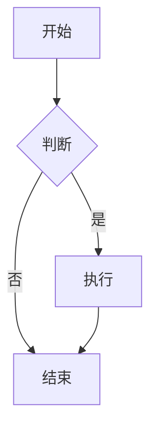
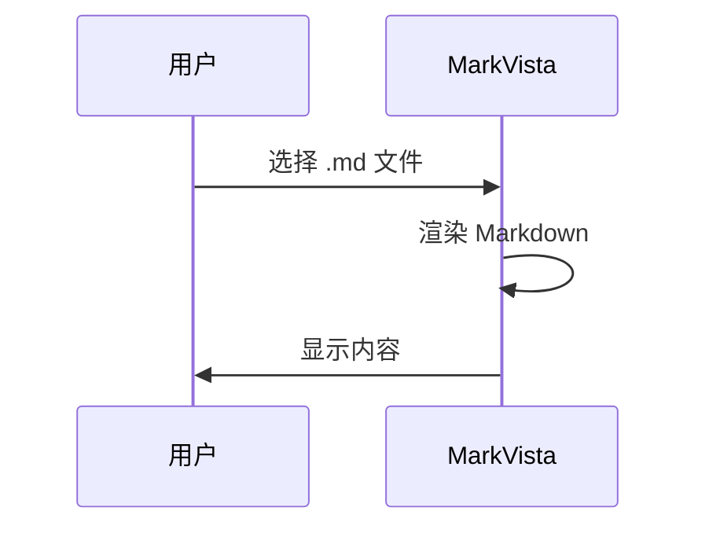

# 示例文档

用于验收 MarkVista 的测试 Markdown 文件。

## 普通文本与列表

这是一段普通段落。支持 **粗体** 与 *斜体*。

- 列表项一
- 列表项二
- 列表项三

## 表格

| 列 A | 列 B | 列 C |
|------|------|------|
| 1    | 2    | 3    |
| 4    | 5    | 6    |

## 代码块

```javascript
function hello() {
  console.log('Hello, MarkVista!')
}
```

## Mermaid 图一（流程图）



## Mermaid 图二（时序图）



## 引用

> 这是一段引用文字，用于测试引用样式。

---

选择本文件后，可验证：Markdown 渲染、两个 Mermaid 图、缩放平移、导出 PDF、导出 PNG 长图。
